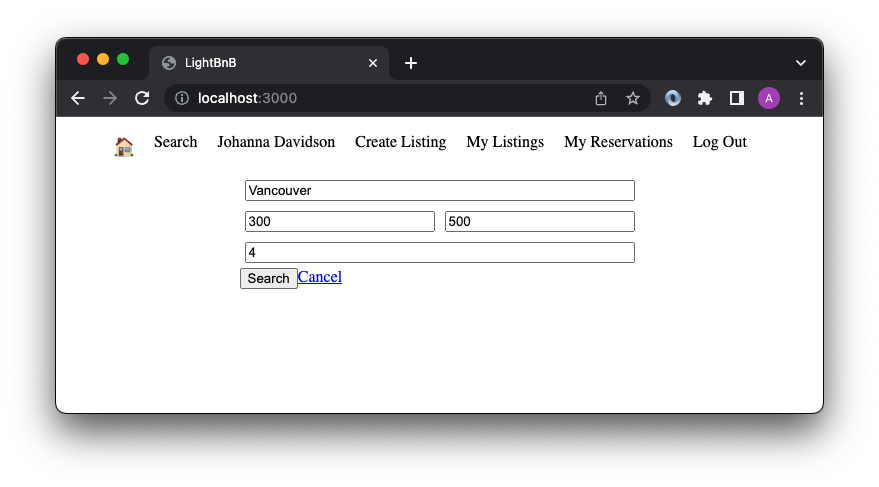

# LightBnB Project
A simple multi-page Airbnb clone that uses server-side Javascript to display information from queries to web pages with SQL queries.

## Final Product - Screenshots

- LightBnB ERD

- My Listings Page

- My Reservations Page

- Create Listings Page

- Search Page

## Getting Started
1. Clone this repository onto your local device.
2. Create a database called lightbnb on PostgreSQL and connect to it with the command `\c lightbnb`.
3. Run the schema file with the following command `\i migrations/01_schema.sql`.
3. Run the 2 seed files in order with the following commands `\i seeds/01_seeds.sql` and `\i seeds/02_seeds.sql`.
4. In the LightBnB_WebApp folder install all dependencies using the `npm i` command.
5. In the database.js file (LightBnB/LightBnB_WebApp/server/database.js), update user and password values ("Connect to PG database" commented area) with your PostgresSQL database username and password as strings.
6. Start the web server using the `npm run local` command. The app will be serverd at <http://localhost:3000/>.
7. All login user passwords are the same -> password. The password value appears in the seeds files as bcrypt encrypted values.

## Dependencies
- bcrypt
- body-parser
- cookie-session
- express
- nodemon
- pg